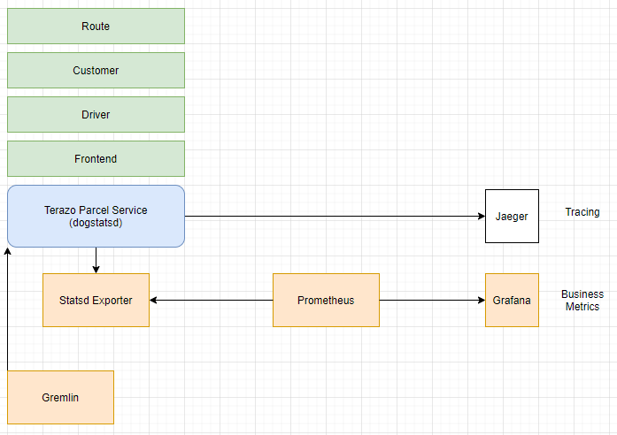

# Terazo Parcel Service



---

### How to Run This App in Local

1. Open `/cmd/frontend.go`. In line 38-40, change the hostname to `0.0.0.0`.
2. Run the following command
```shell
go run main.go ${cmd}
```
Fill in `cmd` with the service you want to run. If you want to start the whole app, use `all`.

## How to Run This App with Docker Compose

1. After making changes to any of the services, rebuild and push the image of that service with. Make sure you change the service name in the dockerfile to match the service you are building.


```shell
docker login --username finneganhu --password luck_dragons
docker build -t finneganhu/${service_name}:${tag_name} .
docker push finneganhu/${service_name}:${tag_name}
```

2. Start the app by running

```shell
docker-compose up
```

## How to Run This App with Local Kubernetes

1. Start a `minikube`

```shell
minikube start
```

2. Bring up the Kubernetes service objects:

```shell
kubectl apply -f kube-app-services
```

3. Start the api deployments:

```shell
kubectl apply -f kube-app-${version}-deployments
```

4. Run

```shell
minikube tunnel
```

5. Run

```shell
kubectl get services
```

and look for the host IP and port of `frontend` service.

## How to Run This App with EKS

1. Update the context of `kubectl` by running:

```shell
aws eks --region us-east-1 update-kubeconfig --name ms-demo-app
```

2. Bring up the Kubernetes service objects:

```shell
kubectl apply -f kube-app-services
```

3. Start the api deployments:

```shell
kubectl apply -f kube-app-${version}-deployments
```
4. Run

```shell
kubectl get services
```

and look for the host IP and port of `frontend` service.

## Metrics
- The TPS app uses Prometheus to scrape the application metrics
- Each service is enabled by adding the endpoint /metrics to the service and configuring prometheus to scrape that host and port
- metrics can be view by the respective address /metrics 
    ```shell
    localhost:8084/metrics
    ```
    or by visiting prometheus on port 9090

##Container monitoring
- When you run docker compose to start the application it will start a container called cadvisor along with the others. The Container monitors all of the system metrics in each of the containers and sends them to prometheus.
- Cadvisor can be viewed on localhost:8080 


## Simulated errors
- The TPS frontend has a feature to simulate a bad request to the Frontend service.
- There is also a 5% chance that the Customer service will fail, these errors are tracked with the prometheus by state and region.
